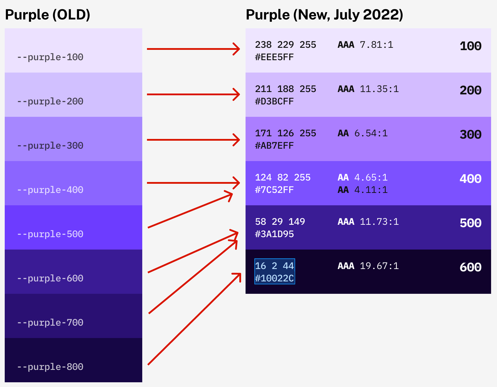
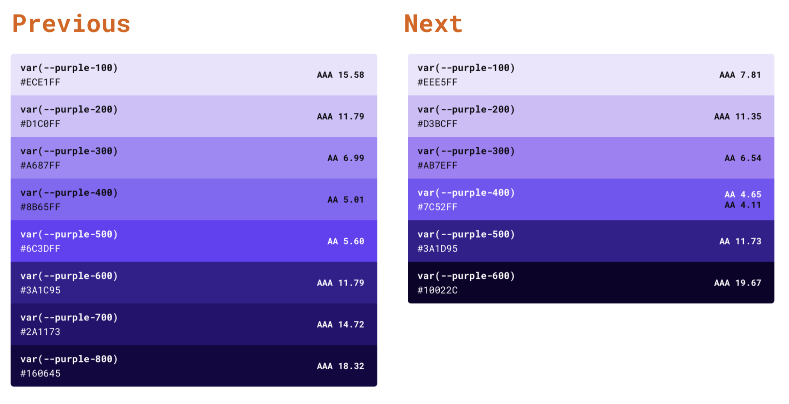

# Dialtone 7 Migration guide

Migration from version `6` to `7` is mostly visual, focusing on CSS updates.

While the migration is fairly straightforward, there may be instances where manual updates to a product's code are required. These are usually search-and-replace tasks, and may include decisions to be made with your Product Designer; for example, contrast ratios to meet accessibility requirements.

**⚠️ Note for `dialtone-vue`:** Updating `dialtone-vue` to the latest beta version components automatically receive Color updates.

## Changes

### Updated Color Ramps

✅ Complete 🟨 In Progress 🛑 TBD

- ✅ Purple
- 🟨 Blue
- 🟨 Tan
- 🛑 Green
- 🛑 Black
- 🛑 Yellow/Gold
- 🛑 Pink/Magenta
- 🛑 Red


#### Purple
1. Updated color values for `purple-100`, `purple-200` and `purple-300` stops.
2. Consolidated Dialtone v6's `purple-400` and `purple-500` stops into the redefined `purple-400` stop.
3. Consolidated Dialtone v6's `purple-600` and `purple-700` stops into the redefined `purple-500` stop.
4. Consolidated Dialtone v6's `purple-800` stop into the redefined `purple-600` stop.

[Before/After images to be replaced with one that reflects **all** Color Ramps once completed.]
Purple Remapping | Before and After
:-------------------------:|:-------------------------:
 | 
#### Blue
[TBD]
#### Tan
[TBD]
#### Green
[TBD]
#### Black
1. Removed `black-025`, `black-050`, `black-075` color stops.
2. Updated color values for `black-100`, `black-200`, `black-300`, `black-400`, `black-500`, `black-600`, `black-700`, `black-800`, `black-900` stops.
3. Consolidated Dialtone v6's `black-600` and `black-500` stops into the redefined `black-600` stop.
4. Consolidated Dialtone v6's `black-400` and `black-300` stops into the redefined `black-500` stop.
5. Consolidated Dialtone v6's `black-200` and `black-100` stops into the redefined `black-400` stop.
#### Yellow/Gold
[TBD]
#### Pink/Magenta
1. Renamed `pink-[100-700]` to `magenta-[100-500]` color stops.
2. Consolidated Dialtone v6's `pink-100`, `pink-200` and `pink-300` stops into the redefined `magenta-100` stop.
3. Consolidated Dialtone v6's `pink-400` stop into the redefined `magenta-200` stop.
4. Consolidated Dialtone v6's `pink-500` stop into the redefined `magenta-300` stop.
5. Consolidated Dialtone v6's `pink-600` stop into the redefined `magenta-400` stop.
6. Consolidated Dialtone v6's `pink-700` stop into the redefined `magenta-500` stop.

#### Red
[TBD]

### Removed Primary Color Theme
- Removed the `--primary-color` theme variable.
- Removed `d-fc-primary` utility class.
- Removed Spot Illustrations' theming capability.

## Migration Steps

Follow steps in this exact order.

### 1. Update to Dialtone v7

```
npm install @dialpad/dialtone@beta
```

### 2. Replace color stops

Search for | Replace with
:-:|:-:
`purple-500` | `purple-400`
`purple-600` | `purple-500`
`purple-700` | `purple-500`
`purple-800` | `purple-600`
`black-500` | `black-600`
`black-400` | `black-500`
`black-300` | `black-500`
`black-200` | `black-400`
`black-100` | `black-400`
`black-075` | `black-300`
`black-050` | `black-200`
`black-025` | `black-100`
`pink-100` | `magenta-100`
`pink-200` | `magenta-100`
`pink-300` | `magenta-100`
`pink-400` | `magenta-200`
`pink-500` | `magenta-300`
`pink-600` | `magenta-400`
`pink-700` | `magenta-500`
`d-fc-pink` | `d-fc-magenta`
[others TBD, e.g. Green] | ...

### 3. Replace "Primary Color" theme uses

#### Custom CSS references to expired "Primary Color" CSS Variables

Search for | Replace with
:-:|:-:
`var(--primary-color)` | `hsl(var(--purple-400-h) var(--purple-400-s) var(--purple-400-l))`
`var(--primary-color-hsl)` | `hsl(var(--purple-400-h) var(--purple-400-s) var(--purple-400-l))`
`var(--primary-color-hover)` | `hsl(var(--purple-400-h) var(--purple-400-s) calc(var(--purple-400-l) - 10%))`
`var(--primary-color-h)` | `var(--purple-400-h)`
`var(--primary-color-s)` | `var(--purple-400-s)`
`var(--primary-color-l)` | `var(--purple-400-l)`

#### Replace "Primary Color" CSS Utility classes usage, e.g. `class="[UTILITY]"`

Search for | Replace with
:-:|:-:
`d-fc-primary` | `d-fc-purple`

### 4. Replace hardcoded HEX values

Any custom CSS authored with HEX values (e.g. `#ff0000`) should be replaced with its CSS Custom Property equivalent (e.g. `var(--[COLOR-STOP])`).

#### Example

Replace...

```css
.foo { color: #ECE1FF; }
```

...with
```css
.foo { color: var(--purple-100); }
```

Search for | Replace with
:-:|:-:
`#ECE1FF` | `var(--purple-100)`
`#A687FF` | `var(--purple-300)`
`#8B65FF` | `var(--purple-400)`
`#6C3DFF` | `var(--purple-400)`
`#3A1C95` | `var(--purple-500)`
`#2A1173` | `var(--purple-500)`
`#160645` | `var(--purple-600)`
`#F2F2F6` | `var(--black-100)`
`#EAE9EF` | `var(--black-200)`
`#DFDEE5` | `var(--black-300)`
`#CDCDD8` | `var(--black-400)`
`#B3B0C0` | `var(--black-400)`
`#9C99AC` | `var(--black-500)`
`#7B7789` | `var(--black-500)`
`#575564` | `var(--black-600)`
`#444150` | `var(--black-600)`
`#322D37` | `var(--black-700)`
`#221F24` | `var(--black-800)`
`#0D0C0F` | `var(--black-900)`
`#FFEBEC` | `var(--magenta-100)`
`#FFD8DA` | `var(--magenta-100)`
`#FDA2A8` | `var(--magenta-100)`
`#FF578A` | `var(--magenta-200)`
`#E92A7A` | `var(--magenta-300)`
`#A2114D` | `var(--magenta-400)`
`#57102E` | `var(--magenta-500)`

### 5. Check color updates for readability

Check updates to confirm desired rendering and alignment to contrast accessibility requirements. When in doubt, confer with your Product Designer to identify a proper solution.
